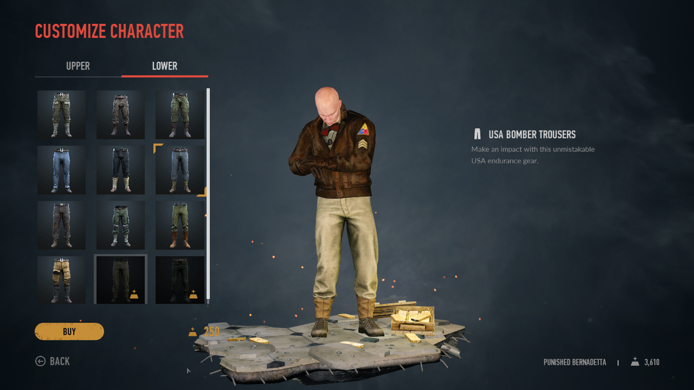
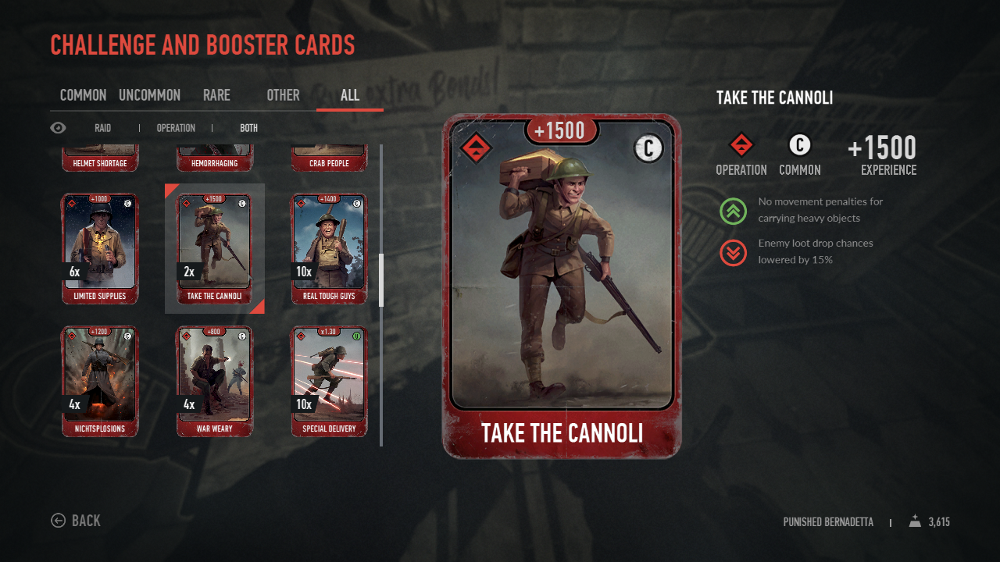
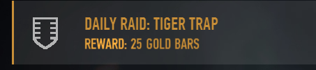
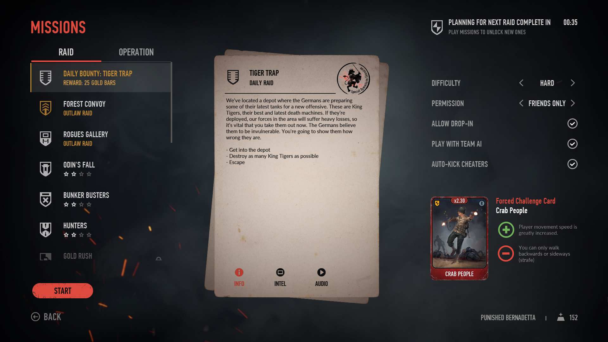
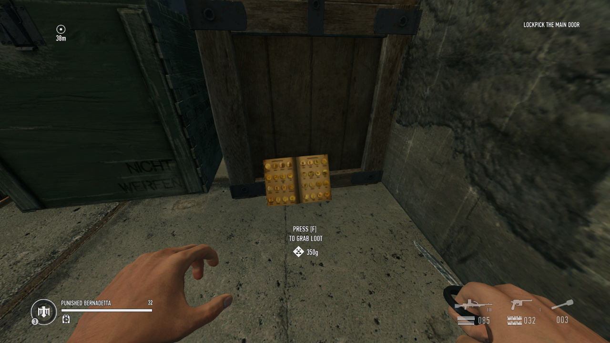

# Update from June 26th 2025

On June 26th 2025, MUG team released Bounty Blitz, adding official Daily Bounties to the game. Unlike my implementation, effects each day are completely random.

Now the mod is obsolete since game has this feature already! Good to know that developers actually started making Daily Bounties by straight up copying my implementation, though they did have to change it a lot after they decided on using completely random effects rather than existing cards.

# Original post from October 8th 2024

I love RAID: World War II. While it's objectively a dead game, I thought it was pretty fun, and it was even more fun digging into story of its creation and into the source code to see all the [neat things that weren't in the game](https://tcrf.net/RAID:_World_War_II).

The issue is, after getting every achievement and maxed out every weapon, the only thing I could unlock were outfits, and they were very expensive. Average job that lasted around 15 minutes paid 2 gold bars at best, and limited and rare Outlaw Raids paid ~50. One set of pants is 150 gold bars. That's rough.

_These are good looking pants, but perhaps not 250-gold-bars-looking pants_

And then I thought that another issue the game has is challenge cards - they were supposed to shake up your gameplay every now and then, change how things are, but due to their limited number and lackluster effects, they were rarely if ever used.

_Until recently you only got 3 challenge cards a day if you got lucky, and imagine if you got this one. Positive effect sounds very good for Gold Rush and Trainwreck raids, but then you see that it's an Operation card. There's not a single operation where you carry anything for a meaningful amount of time._

---

To slightly alleviate these problems, I thought of a simple concept: Daily Raid. Every day you would get a random job selected with a random challenge card applied that would grant around the same amount of gold as a single outlaw raid.

It was fun building UI for it, trying to fit all the things I need neatly into the existing job selection menu, but then I had a complicated problem. You see, one of my design goals was for Daily Raid to award to everyone who plays with you, no matter if they have the mod or not. I wanted this because RAID has a tiny player base, and I don't want anyone to miss out on a little fun my mod brings to the game. But this meant that I had to come up with some way to give other players gold.

_After I finished adding a button for a Daily Raid in the menu, I started working on limiting difficulty, because I thought it'd be lame if you could collect it on Easy. During development I thought it should only be collected on Hard, but shortly after release I added ability to collect it on Very Hard as well._

_Working on button design, adding text below instead of difficulty. Shortly after sharing this design, Rex, one of the M.U.G. team members who work on the game right now, suggested renaming it to Daily Bounty and proposed an icon  that is still used today._

_Finally added forced challenge card display. Really proud of how it looks, like it was part of the UI all along._

Giving player who has the mod gold is easy - just call a function to give gold. RAID WW2 mods have complete control over the source code, so it's trivial to do anything on the side of a player who has the mod. When it comes to other players, I'm limited by the commands that they can listen to.

My first idea was messing with Mission Rewards system, but the system itself is very messy and is entirely controlled on client side, so I can't do anything about it for the un-modded players.

Then I realized something: in the levels you sometimes find small golden items, like watches and vases, and if you pick up enough of them, you get a gold bar. And even better, host controls placement of these small items, so they can just tell everyone "hey, there's a new golden item" and then immediately pick it up to give everyone some gold.

_They keep leaving coin collections all over the place, but I don't mind._

That method worked flawlessly, and I was able to give everyone connected arbitrary amount of gold just by spawning a single golden item and constantly telling everyone "I picked it up, it was worth 1 gold bar" times however many gold bars I needed to give everyone. I actually couldn't just say "item I picked up was worth many gold bars" because game actually couldn't add multiple gold bars at once.

---

[Mod was done](https://modworkshop.net/mod/38718). After many patches, it was stable, too. It became quite popular among those who still wanted to play RAID.

Years later, a big revival update for RAID was released: Update 22. New skill system, many balance changes, reworked missions, it was fantastic. Quickly modding tools were updated to support it and I started fixing up my mods.

After patching all the UI issues my mods were having, I noticed that gold rewards don't work anymore. After hours of trying to figure out what's the cause, I found out that it's because now golden items have a value property in them. The issue is, this value is 0 by default, and it only gets set during loading screen, meaning that my "spawning a golden item and picking it up" doesn't work anymore, since this newly spawned item is worth 0 gold.

While developers were adding a proper fix so I don't have to do any of that silliness again, I was thinking of other ways to grant people gold. I thought "now loot you secure in normal missions gives gold too, right? How does that work?". The system was dead simple: when item touches secure area, host tells everyone "this variety of loot was secured!". This meant that all I have to do to give everyone tons of gold, is just tell everyone "I just secured a ton of items".

It was fun discovering all these hacks, though (un)fortunately developers did add a proper fix for my issue: a simple command that can be called once per raid to give everyone limited amount of gold.

It was a fun journey. My method or granting additional gold via pickup system is now used for all loot, and I actually helped and found a bunch of issues with the system in the game because I first encountered them in my mod. Now I'm planning on adding more challenge cards to the game, though that won't be coming any time soon.
