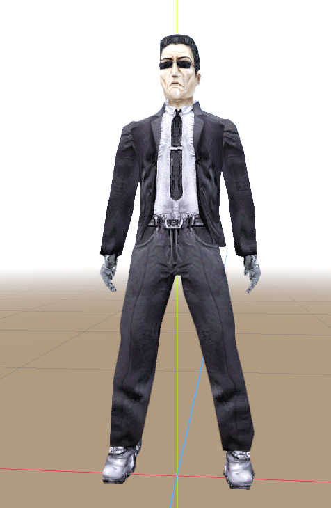

# Contents

# Introduction

On April 21st, Internet Archive and CanDev organized a game jam centered around their [DiscMaster](https://discmaster.textfiles.com/): archive and search engine for a ton of old CDs full of pictures, sounds, music, and other goodies, a lot of which are not preserved online.

The goal was to make a game using only (or mostly) DiscMaster assets in a week. Looked really fun to me, so I joined.

I quickly got this idea of a game where you want to share an old game with a friend, and as you are doing so, corporate lawyers are breaking in and stealing your CD, and you have to chase them and beat them all up in the process.

While it's not my first time making something for a game jam, it was still a lot of fun.

# Development

## Basics

I started by downloading Kenney's Starter Kit FPS: a template Godot project with basic first person player controls. I removed everything unnecessary from it, like weapon switching, since my game doesn't have any weapons. I reused shooting code for punching, which in retrospect was a mistake, since no one expects punches to land exactly in the center of the screen.

I was briefly considering keeping jumping in the game, even added some tweening to hands to make you put them down while you are in the air, but when I started actually adding enemies, I realized that jumping is completely unnecessary, so it was removed as well.

I was looking for a good model for enemy lawyers, and luckily for me, DiscMaster collection features a lot of Half-life mods, some featuring custom skins for G-Man!

I threw together some animations for them. Godot's animation tools, while slightly improved in version 4.4, are still really annoying.

*Clip from the end of Day 1*

## Building levels

To build levels for my game I decided to use [Cyclops Level Builder](https://github.com/blackears/cyclopsLevelBuilder). It's a plugin for Godot that adds level editing capabilities similar to those in Hammer editor, used to create maps for Source games. As I had a bit of experience with Hammer, it was a natural fit for me.

Using Cyclops also gave me a direction for my artstyle: GoldSrc. All props through levels built out of brushes, all low-poly, with blurry textures. Would be even closer to GoldSrc aesthetic if I could use prebaked lighting, but Cyclops doesn't allow for that without making the map uneditable.

*After sharing this screenshot, Lilithpad on DiscMaster discord asked if computer could be destroyed. I thought it was a funny idea, and that's how my game got a Breakable Prop system. That system ended up so versatile, that every interactable thing in the game is actually a breakable prop.*

Speaking of Cyclops limitations, another Cyclops limitation is that Godot's default navigation system doesn't work with Cyclops levels at all. I guess Cyclops blocks aren't considered solid by it? Either way, because of that I actually couldn't even make AI follow you around corners, which surprisingly ended up not being too noticeable anyways.

*Clip from Day 2*

## Scripted events

As fun as it was to fight enemies who just stand in the open waiting for you to come over and beat them up, I obviously needed fancier ways for enemies to appear. That's how I created the main driving force behind most of the game: Scriptable Spawn system.

It was quite simple: for every scripted sequence, I created a node inside of which I defined every "Animation Object" and enemy that it should trigger. "Animation Objects" could range from doors getting kicked open, to dialogue playing, to taking control away from the player. While the implementation was very flawed, it worked fine for my purposes, so I was happy with it.

*Clip from day 4.*

## Level 2

After fighting your way through an apartment building, next level is set at the Corporation HQ. Initially it was meant to be a series of fights through office cubicles, but then I remembered about The Matrix lobby fight and thought there's no way I'm not gonna include that.

*Clip from day 5. After building the lobby, I thought it would look absolutely epic if lights dramatically turned off and on. It did look awesome!*

Though unfortunately, fight in the lobby was pretty much an afterthought. I just added 8 doors and shoved 8 enemies behind them, and hoped it'd play well. While it was actually pretty fun and unique for the game, it was also a little less dramatic than I wanted.

## Level 3

Third level wasn't initially planned at all. Originally, level 2 was supposed to be a 2 storey neoclassical building with a few generic offices. Though obviously after I decided to make entrance look like lobby from The Matrix, that idea was abandoned.

New level 3 was partially based on Tai Yong Medical level from Deus Ex: Human Revolution. I really loved its warm atmosphere, though I think my version was a little too white, so it felt colder.

CEO's office was very rushed. Originally, I had ideas to add a lot of details, like trophies saying "BIGGEST ASSHOLE EVER", diplomas of excellency at making money, etc. In the end, I ran out of both time and motivation, so office ended up quite empty. I did try really hard to have nice lights in it.

*I really wanted final door to say "License Key Required", but I was anxious players would actually think they need to find a license key somewhere. My friend suggested adding a huge crack on the door, since players are likely to recognize cracked things as breakable. Even after these changes, I thought players still might not notice it, so I had a silly idea to put a "Fragile" sticker on it as well.*

## Total Awesomesauce

I wanted game's MacGuffin to be some rare but totally awesome game, so I quickly came up with a name "Total Awesomesauce" for it.

*Design of the disc was inspired by a game I tried making ages ago while learning Python. It was called "Parrot to Hell", side scrolling shoot-em-up where you play as a parrot on a motorcycle with an AK-47 driving on a Highway to Hell and shooting demons. Game never got past a prototype stage, though its idea is, as some would say, total awesomesauce.*

## Cutscene voice acting

Originally, I was aiming for "50-99% DiscMaster Assets" category, and those 1-50% of non-DiscMaster assets were all meant to be voice lines for cutscenes. My idea was to ask my friends to help me voice act for the game, but as end of the jam was getting closer, I realized that my plan had 2 issues:

1. It's surprisingly hard to find time when more than like 1 of my friends is awake.
2. None of them have the voice I needed for the CEO.

With this realization, me and my friend started brainstorming what are we going to do now.

He suggested doing Banjo & Kazooie style voice acting, where instead of proper dialogue, characters just make speech-like noises. I thought it was a great idea, so I opened DiscMaster website and started looking for some voice similar to what I imagine CEO should sound like. After thinking about it for a bit, I realized that perfect voice would be the same person who gave CEO, and all the lawyers, their models - G-Man from Half-life 1! And I knew DiscMaster has Half-life 1 assets, though apparently only German version of them.

After testing that style of voice acting, we thought it didn't sound great, but my friend had a great idea: why not just use those German voice lines directly? It's not like too many people would notice that spoken dialogue is complete nonsense. And that's how game got all its voice acting!

After release I asked my Austrian friend to check my game out and he burst out laughing during opening cutscene.

# Conclusions

1. Cyclops Level Builder, while really nice to have, is very clunky. For my next project I should probably learn how to use [func_godot](https://github.com/func-godot) instead.
2. Feedback for where punches actually hit is really bad, and a lot of players really figure it out. I should've addressed it earlier and just made whole area in front of the player a hitbox.

I also wish I added a timer and other statistics on the end screen, like "Lawyers taught a lesson: X/Y", or "Destructible objects destructed: X/Y". Would add some replayability.

I'm very happy people enjoyed my game. Isn't that what game development is all about: making people happy?

Go play it now! I hope you enjoy it! https://punishedbernadetta.itch.io/get-that-cd-back
